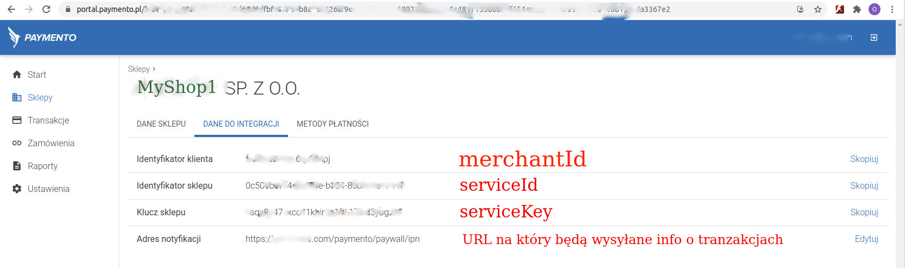

# System do opłacania zamówień w `Paymento`

System realizowany jako moduł pod nazwą `paymento` i jest podłączony w pliku konfiguracyjnym `config/web.php`
sekcja `modules`. Moduł realizuje tylko jeden sposób
płatności: [Bramkę płatności](https://paymentopaywall.docs.apiary.io/#/introduction/wprowadzenie)

## Instalacja

Zalecany sposób instalacji przez [composer](http://getcomposer.org/download/)

Możesz uruchomić

```
php composer.phar require --prefer-dist ststichua/yii2-paymento
```

lub dodać

```
"stitchua/yii2-paymento":"*"
```

do sekcji `require` twojego composer.json

Po instalacji pakietu należy uruchomić migrację (w konsoli):
```
php yii migrate --migrationPath="@stitchua/paymento/migrations"
```

## Konfiguracja

Do konfigurowania modułu służą:

- `merchantId` - ID konta w systemie płatnościowym Paymento
- `payloadModelClass` - Klasa opłacanego zamówienia np. 'app/models/Invoice'. Dana klasa ma realizowywać dwa
  interface-y:
    - [stitchua\paymento\base\PaymentoPayloadRequestDataInterface]
    - [stitchua\paymento\base\PaymentoResponseDataInterface]
- `shops` - sklepy z systemu płatnościowego Paymento. Sklepów może być kilka. Każdy sklep jest skonfigurowany za pomocą
  trzech parametrów:
    - `nazwaSklepu` - klucz, dowolna unikalna nazwa pośród innych sklepów, można je dodać do stałych w
      klasie [[stitchua/paymento/Paymento]].
    - `serviceId` - identyfikator sklepu nadany w systemie Paymento;
    - `serviceKey` - prywatny klucz nadany w systemie Paymento, jest wykorzystywany do obliczenia `sygnatury` (hash
      kodu) przekazywanych danych do systemu Paymeno.

Klasa odzwierciedlająca dane przekazywane do Paymento [[stitchua/paymento/models/Paywall]]

### Wyliczenie sygnatury notyfikacji z Paymento

> Sygnatura w notyfikacji z Paymento wylicza się ze wszystkich pól
**'transaction'** przekazanej w notyfikacji i ma być porównywana z sygnaturą przekazaną w nagłówku `x-paymento-signature`

### Jak korzystyać

1. W klasie która odpowiada w twoim systemie za zamówienie implementuj dwa interface-y:

- [stitchua\paymento\base\PaymentoPayloadRequestDataInterface]
- [stitchua\paymento\base\PaymentoResponseDataInterface]
2. Skonfigurować jak opisno w sekcji [konfiguracja](#konfigurujemy)
3. Dodać przycisk do płatności

#### Realizujemy interface-y

```php
// Istniejąca klasa/model Invoice
namespace app\models;

use stitchua\paymento\models\PaymentoTransaction;use yii\db\ActiveRecord;
use stitchua\paymento\base\{
    PaymentoPayloadRequestDataInterface,
    PaymentoResponseDataInterface
};

class Invoice extends ActiveRecord implements PaymentoPayloadRequestDataInterface, PaymentoResponseDataInterface
{

    public function getCustomerFirstName() : string{
     // TODO: Implement getCustomerFirstName() method.
     return $this->account->first_name;
    }
    public function getCustomerLastName() : string{
     // TODO: Implement getCustomerLastName() method.
     return $this->account->last_name;
    }
    public function getCustomerEmail() : string{
     // TODO: Implement getCustomerEmail() method.
     return $this->account->email;
    }
    public function getAmount() : int{
     // TODO: Implement getAmount() method.
     return $this->amount * 100; // Zwracamy w groszach
    }
    public function getId() : int{
     // TODO: Implement getId() method.
     return $this->id;
    }
    public function getTitle() : string{
     // TODO: Implement getTitle() method.
     return $this->invoicenumber;
    }
    public function paymentoOrderInvoiced(PaymentoTransaction $transaction){
         // TODO: Implement paymentoOrderInvoiced() method.
         if($transaction->canBeSettled()){
            $this->settle();
         }
    }
}
```
#### Konfigurujemy
W pliku konfiguracyjnym config/web.php (dla basic template) dodajesz:
```php
[
    'modules' => [
        'paymento' => [
            'class' => 'stitchua\paymento\Paymento',
            'merchantId' => 'jahds-we4fde-erge-fgsf', // ID twojego konta w Paymento
            'payloadModelClass' => 'app\models\Invoice', // Klasa realizująca interface-y
            'successReturnUrl' => 'https://mysite.com/site/payment-landig-page?status=success',
            'failureReturnUrl' => 'https://mysite.com/site/payment-landig-page?status=error',
            'shops' => [
                // Nazwa sklepu, dowolno ustawiona przez ciebie
                'myShop1' => [
                    'serviceId' => 'id-sklepu-nadany-przez-paymento', // ID sklepu z Paymento
                    'serviceKey' => 'tayny-klusz-twojego-sklepu' // klucz sklepu z Paymento
                ]
            ]
        ]
    ]   
]
```
#####Dane do konfiguracji
Dane do konfiguracji pobierz ze swojego konta w Paymento

>WAŻNE!!! Nie zapomniej wpisać URL do wiadomości zwrotnych od Paymento. Bo w takim razie nie będą księgowane
> twoje zamuwienia u Ciebie w systemie.

#### Tworzymy przycisk w widoku
W widoku faktury `app\views\invoice\view.php` wyświetlamy przycisk do opłacenia faktury jeśli faktura jeszcze nie jest opłacona
```php
use stitchua\paymento\models\Paywall;

$invoice = Invoice::findOne(10);
if(!$invoice->isSettled){
 echo \yii\helpers\Html::a('Opłać fakturę',  [
        '/stitchua/paymento/pay-for-order', 
        'id' => $invoice->fld_id, 
        'shopName' => 'myShop1', 
        'payMethod' => Paywall::METHOD_PBL], 
        [
            'class' => 'btn btn-success',
            'target' => '_blank'
        ]
    );
}

```